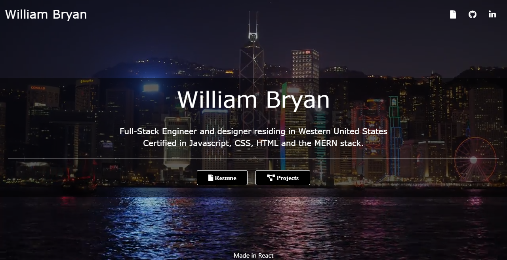

# React-Portfolio

----------------------

## Table of Contents

[Description](#Description) |
[Deployed Link](#Deployed-Link) |
[Prerequisites](#Prerequisites) |
[Technologies](#Technologies-Used) |
[Website Image](#Website-Image) |
[Authors](#Authors) |
[License](#License) |
[Acknowledgements](#Acknowledgements) |

## Description

Application is an updated portfolio site made in React

## Deployed Link

[Link](https://weilibryan.github.io/React-Portfollio/)

## Prerequisites

None

## Technologies Used

- Javascript
- CSS
- JSX
- React

## Website Image

## Authors

1. **William W. Bryan**

- [Github](https://github.com/WeiLiBryan)
- [LinkedIn](https://www.linkedin.com/in/william-bryan-72730019a/)

## License

## Acknowledgements

- [Stack Overflow](https://stackoverflow.com)
- [w3schools](https://w3schools.com)

### [Back to Table of Contents](#table-of-contents)